# Neural Networks: Theory and Implementation (NNTI)

This repository contains implementations of various assignments and a project related to the [Neural Networks: Theory and Implementation](https://www.lsv.uni-saarland.de/neural-networks-theory-and-implementation-nnti-winter-2023-2024/) course lectured by [Prof. Dr. Dietrich Klakow](https://www.lsv.uni-saarland.de/people/dietrich-klakow/) at [Saarland University](https://www.uni-saarland.de/) during the Winter Semester 2023/24. *All course materials and assignments outlines belong to the course's instructors*. *No guarantee is given to the correctness of the solution of the assignments, or any code implementation in this entire repository.*

## Table of Contents
- [Neural Networks: Theory and Implementation (NNTI)](#neural-networks-theory-and-implementation-nnti)
  - [Table of Contents](#table-of-contents)
  - [Assignments](#assignments)
    - [Todos](#todos)
  - [Project: Multilingual Language Models Representations and Fine-Tuning](#project-multilingual-language-models-representations-and-fine-tuning)
    - [Introduction](#introduction)
    - [Datasets](#datasets)
    - [Methods](#methods)
    - [Experiments and Analyses](#experiments-and-analyses)
    - [Conclusion](#conclusion)
    - [Limitations](#limitations)


## Assignments
To pack an assignment
```sh
./ass.sh pack [-o <outdir>] <assignmentdir>
```

Before that, please install zip
```sh
sudo apt install zip
```

To scaffold for a new assignment
```sh
./ass.sh new <assignmentdir>
```

### Todos
- Enable assignment number option in 'new' command
- Fixed the copy name (intead of template.tex, copyto a<n>sol.tex) in 'new' command

## Project: Multilingual Language Models Representations and Fine-Tuning
### Introduction
The project evaluates the models: [XGLM-564M](https://huggingface.co/facebook/xglm-564M), a multilingual autoregressive language model (with 564 million parameters) trained on a balanced corpus of a diverse set of 30 languages totaling 500 billion sub-tokens, and [GPT-2](https://huggingface.co/openai-community/gpt2), a transformers model pretrained on a very large corpus of English data in a self-supervised fashion. As evaluation dataset, we used the famous **FLORES-200** dataset, available on HuggingFace [facebook/flores](https://huggingface.co/datasets/facebook/flores), specifically six languages: **English, Spanish, German, Arabic, Tamil, and Quechua**. 

We analyzed the multilingual embeddings (both sentence-level and token-level) from both pre-trained language models using dimensionality reduction techniques: PCA and t-SNE. 

Finally, we finetuned the [XGLM-564M](https://huggingface.co/facebook/xglm-564M) model on a specific language: [Quechua](https://en.wikipedia.org/wiki/Quechuan_languages) with a new dataset and different fine-tuning methods: full fine-tuning, BitFit, LoRA, and IA³. We analyzed their performance and evaluation loss on the six languages mentioned above to see how much the performance on the **Quechua** language improved, and how much it decreased for the rest.


### Datasets
To fine-tune the [XGLM-564M](https://huggingface.co/facebook/xglm-564M), we used **Monolingual-Quechua-IIC**, a monolingual corpus of Southern Quechua, available on HuggingFace [Llamacha/monolingual-quechua-iic](https://huggingface.co/datasets/Llamacha/monolingual-quechua-iic) consisting of nearly 450K segments, presented in the paper [Introducing QuBERT: A Large Monolingual Corpus and BERT Model for
Southern Quechua](https://aclanthology.org/2022.deeplo-1.1.pdf) by Rodolfo Zevallos et al. (2022). Due to computational constraints, we only used `8,192` samples for our fine-tuning experiments, and for every experiment, a `batch_size` of `2`.

### Methods
We explored and compared several fine-tuning techniques:

1. **Full Fine-tuning**: Fine-tunes all model parameters. High adaptability to new tasks. Time-consuming and prone to overfitting.
2. **BitFit**: Fine-tunes only the bias terms of the model. Computationally efficient. Higher loss compared to full fine-tuning [[Zaken et al.]](https://arxiv.org/abs/2106.10199).
3. **LoRA (Low-Rank Adaptation)**: Only trains two smaller matrices to approximate the original weight matrix. Faster and efficient. Performance slightly below full fine-tuning [[Hu et al.]](https://arxiv.org/abs/2106.09685).
4. **IA³ (Few-shot Activation Scaling)**: Trains vectors to scale activations in each layer. Introduces fewer parameters. Limited success due to our computational constraints [[Liu et al.]](https://arxiv.org/abs/2205.05638).

To apply PCA, we used [`scikit-learn`](https://scikit-learn.org/dev/modules/generated/sklearn.decomposition.PCA.html)'s implementation and to apply t-SNE, we used the [`openTSNE`](https://opentsne.readthedocs.io/en/stable/) package. On the other hand, the parameters `perplexity` and `learning_rate` for t-SNE were set based on the number of samples in the data: 
```python
learning_rate = max(200, int(n / 12))
perplexity = max(30, int(n / 100))
```
These are recommendations from the following sources: 
* [Uncertain Choices in Method Comparisons: An Illustration with t-SNE and UMAP](https://epub.ub.uni-muenchen.de/107259/1/BA_Weber_Philipp.pdf) by Weber (2023).
* [New guidance for using t-SNE: Alternative defaults, hyperparameter selection automation, and comparative evaluation](https://www.sciencedirect.com/science/article/pii/S2468502X22000201) by Gove et al. (2022).

### Experiments and Analyses
We first compared the performance of the [XGLM-564M](https://huggingface.co/facebook/xglm-564M) model with [GPT-2](https://huggingface.co/openai-community/gpt2), in terms of *Mean Language Modeling Loss*.

<figure id="xglm-vs-gpt2">
  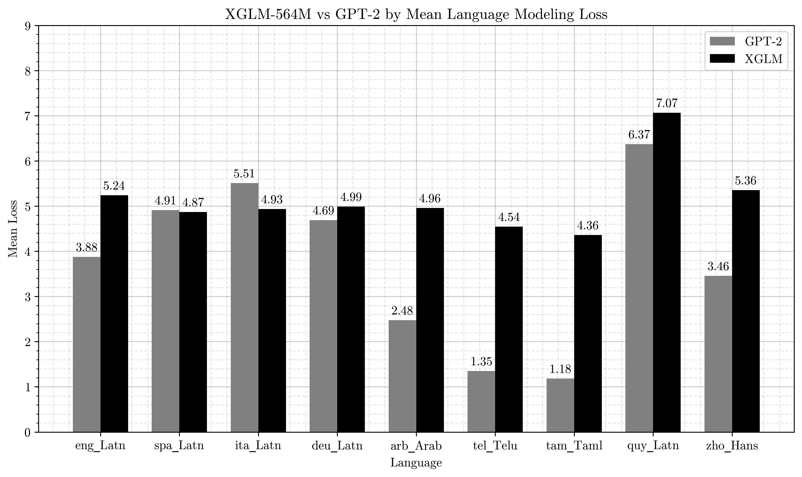
  <figcaption><strong>Figure 1:</strong> Loss of the [XGLM-564M](https://huggingface.co/facebook/xglm-564M) model compared to GPT-2, on the original languages.</figcaption>
</figure>

Afterwards, we visualized the hidden representations of both the XGLM-564M model using PCA and t-SNE for both sentence-level and token-level embeddings across all layers of the model. Below are visualizations from our experiments [^1]:

<table>
<tr>
  <td>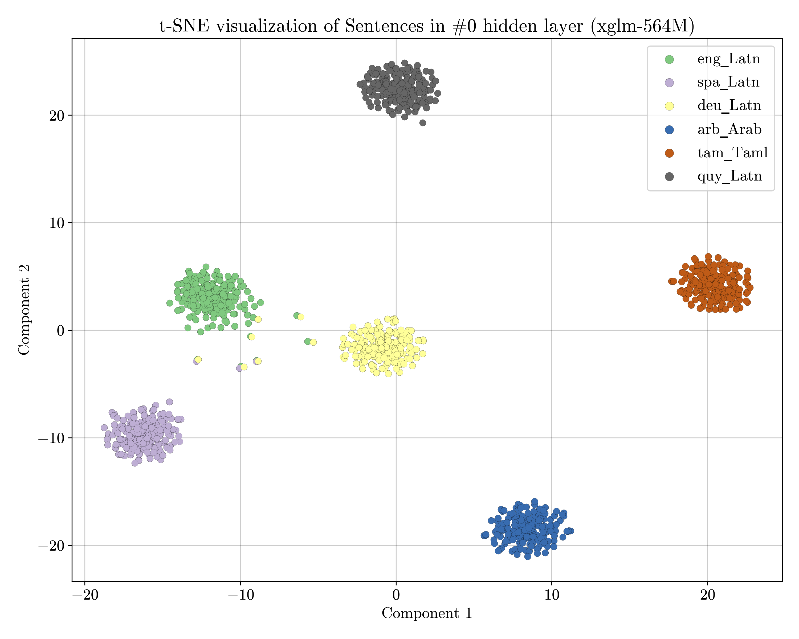</td>
  <td>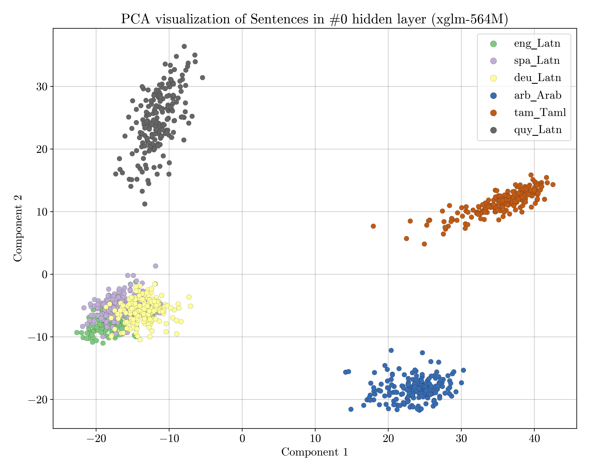</td>
</tr>
<tr>
  <td align="justify"><strong>Figure 2:</strong> t-SNE Visualization of Sentences for Layer 0 of the XGLM-564M Model.</td>
  <td align="justify"><strong>Figure 3:</strong> PCA Visualization of Sentences for Layer 0 of the XGLM-564M Model.</td>
</tr>
<tr>
  <td>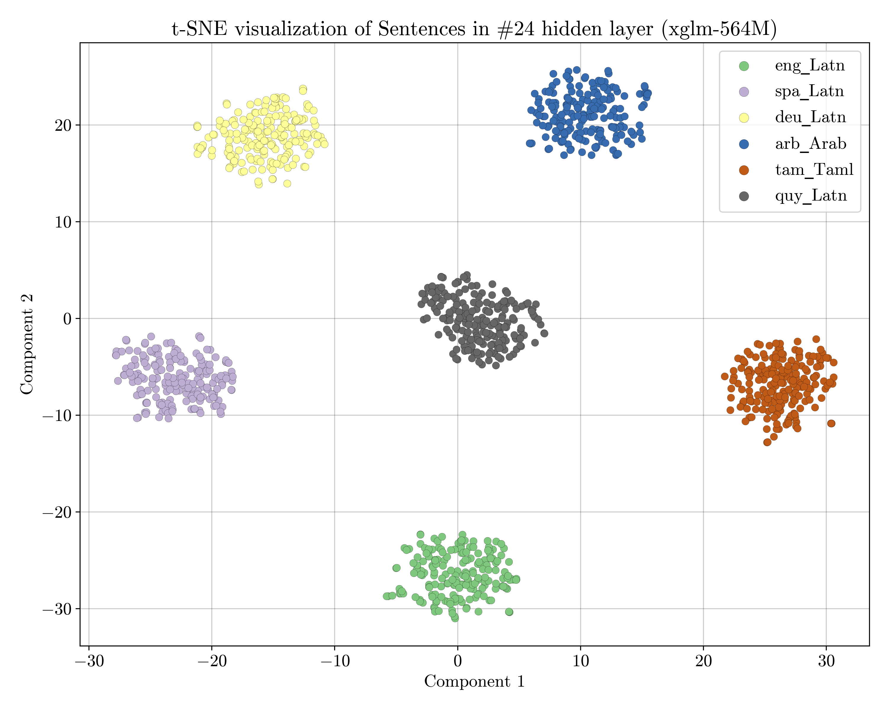</td>
  <td>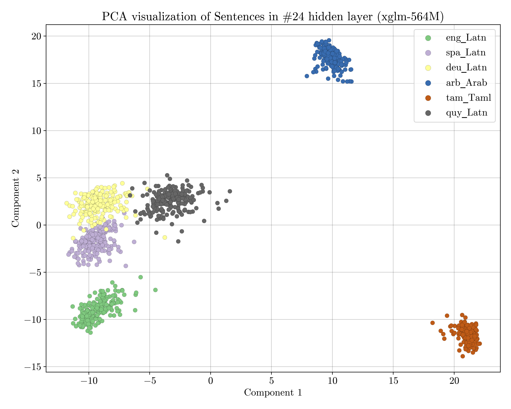</td>
</tr>
<tr>
  <td align="justify"><strong>Figure 4:</strong> t-SNE Visualization of Sentences for Layer 24 of the XGLM-564M Model.</td>
  <td align="justify"><strong>Figure 5:</strong> PCA Visualization of Sentences for Layer 24 of the XGLM-564M Model.</td>
</tr>
</table>

<table>
<tr>
  <td>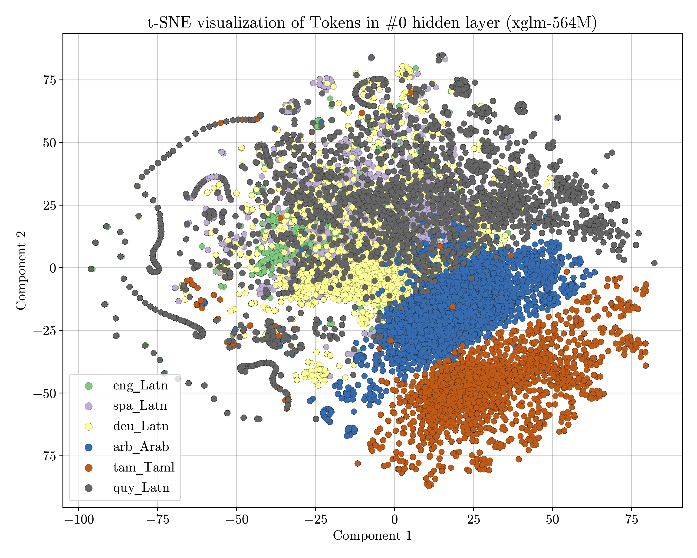</td>
  <td>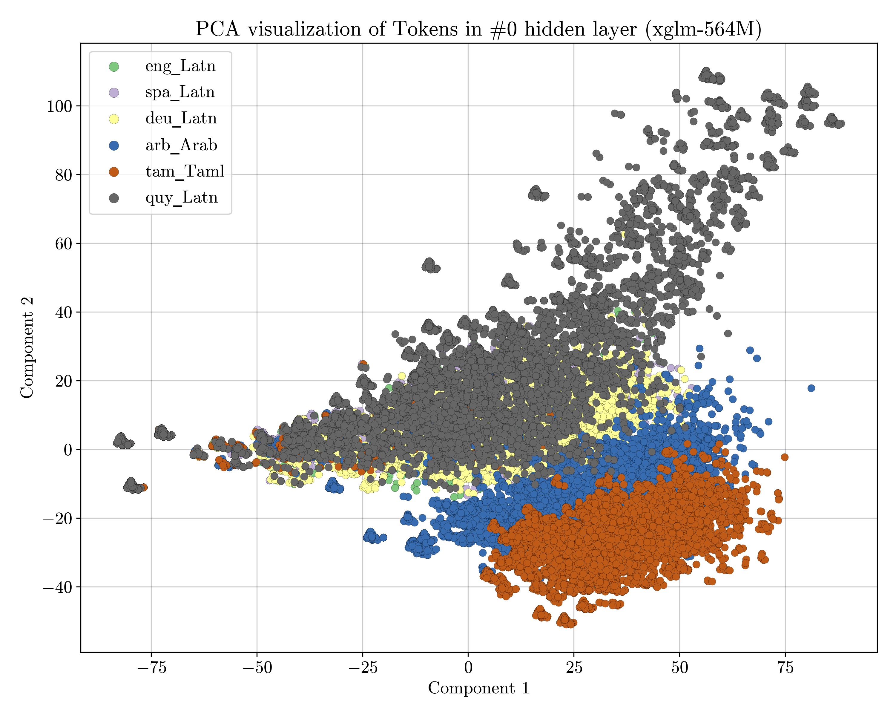</td>
</tr>
<tr>
  <td align="justify"><strong>Figure 6:</strong> t-SNE Visualization of Tokens for Layer 0 of the XGLM-564M Model.</td>
  <td align="justify"><strong>Figure 7:</strong> PCA Visualization of Tokens for Layer 0 of the XGLM-564M Model.</td>
</tr>
<tr>
  <td>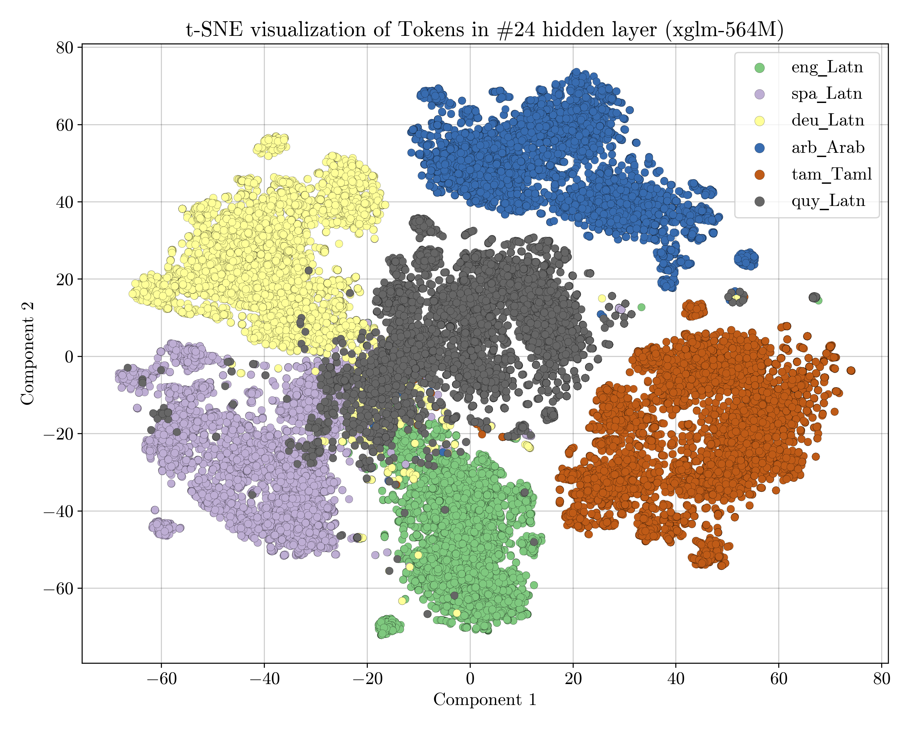</td>
  <td>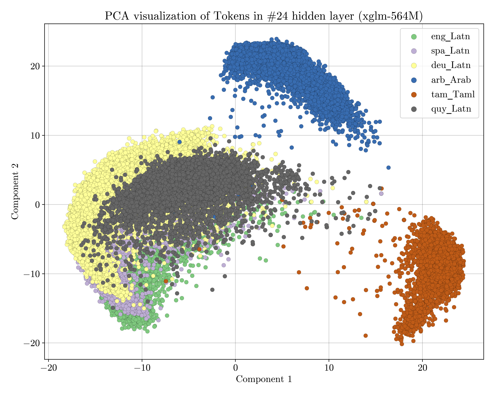</td>
</tr>
<tr>
  <td align="justify"><strong>Figure 8:</strong> t-SNE Visualization of Tokens for Layer 24 of the XGLM-564M Model.</td>
  <td align="justify"><strong>Figure 9:</strong> PCA Visualization of Tokens for Layer 24 of the XGLM-564M Model.</td>
</tr>
</table>

Finally, the results for the fine-tuning of the XGLM-564M model on the Quechua dataset were the following:

<figure id="xglm-vs-finetuned">
  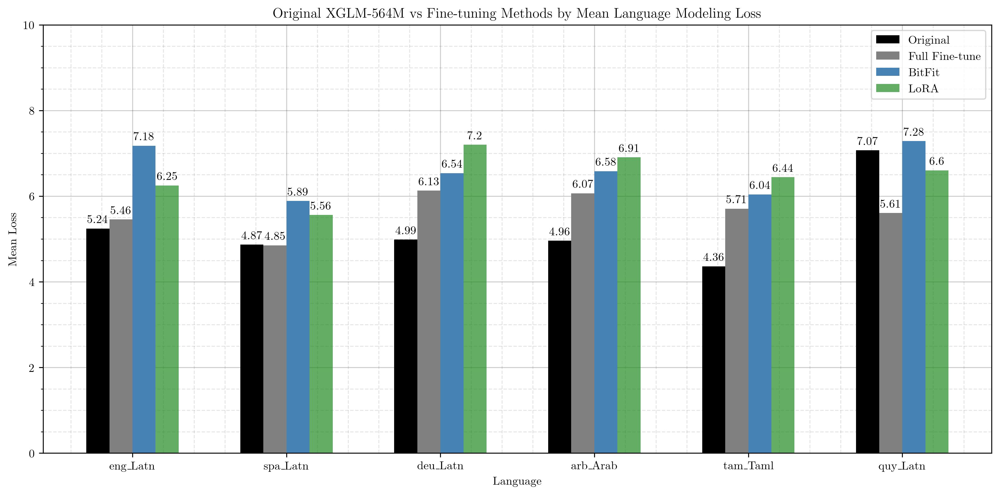
  <figcaption><strong>Figure 10:</strong> Loss of the XGLM-564M Model compared to its Fine-tuned Versions.</figcaption>
</figure>

<p></p>

<figure id="xglm-vs-finetuned">
  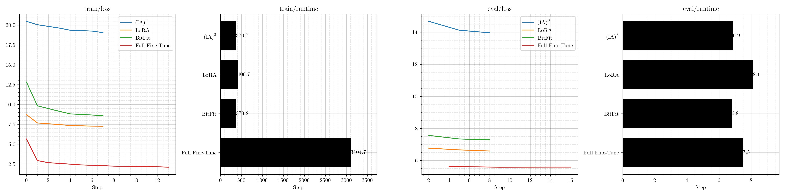
  <figcaption><strong>Figure 11:</strong> Performance metrics comparison of finetuning methods in training and validation.
</figure>

### Conclusion
This project provides insights into multilingual representation spaces (in sentence and token-level) and demonstrates the effectiveness of several fine-tuning techniques. While full fine-tuning offers the best performance, methods such as LoRA and BitFit offer practical alternatives under computational constraints, such as our case.

### Limitations
Due to limited GPU resources, we were restricted to a small `batch_size` of `2` and a reduced dataset size of `8,192` samples, which might have impacted the generalization of our findings. Further research with larger datasets and batch sizes could yield deeper insights.

[^1]: The rest of the illustrations for all layers are in the folder: [NNTIProject/cache/plots_task2](NNTIProject/cache/plots_task2).</sub>
